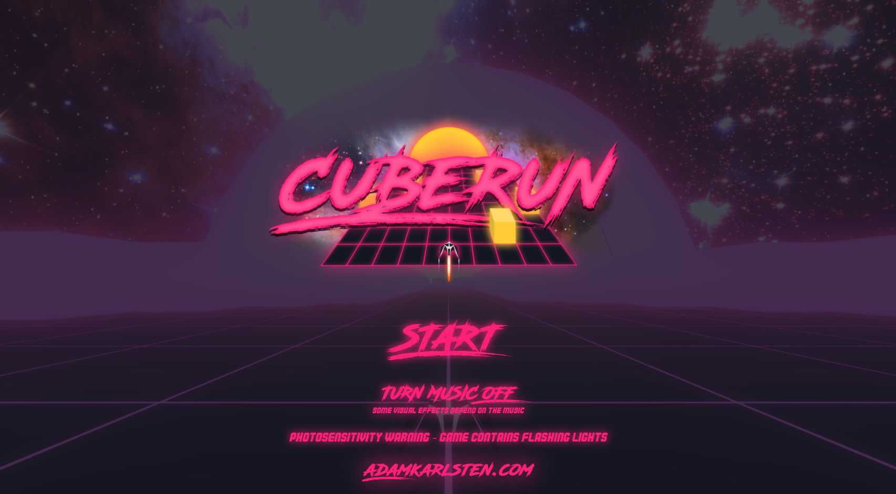
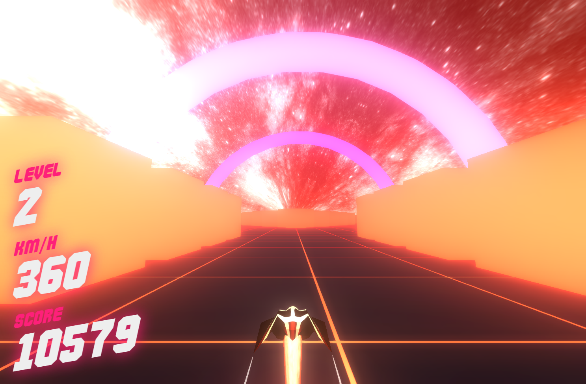

CubeRun is a 3D game where the basic goal is to avoid cubes while the spaceship you control gradually goes faster and faster. It is inspired by an old flash game called [Cubefield](https://www.cubefield.org.uk/) which I played a lot in high school in the late 2000s.

The game is built with react-three-fiber, a React reconciler for THREE.js that allows one to write the (regularly imperative) THREE code in a declarative, React-like manner. I mainly wrote it to become more familiar with react-three-fiber (and 3D graphics in general), but ended up really enjoying working on it. I spent a whole lot of time modelling my own spaceship in Blender, writing a synthwave-ish music track for it, as well as designing a cool logo. All in all I'm very pleased with the results.

