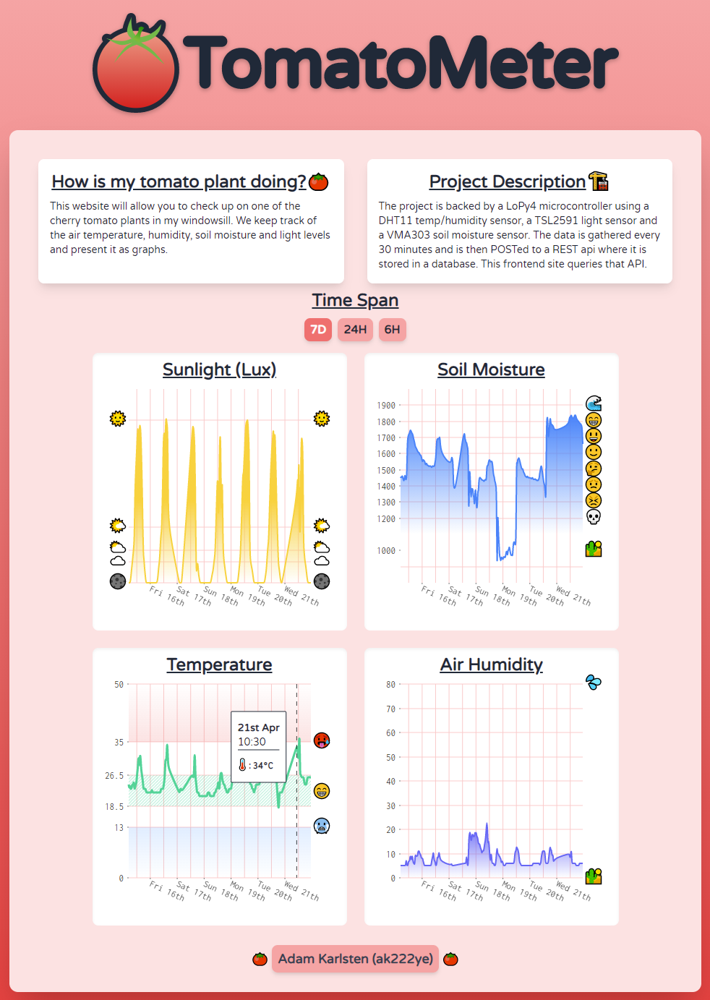

> Note! The tomato plant has since been replanted outside, and the soil moisture sensor corroded into uselessness. Hence the actual website is now pretty much defunct.

This website will allow you to check up on one of the cherry tomato plants in my windowsill. We keep track of the air temperature, humidity, soil moisture and light levels and present it as graphs.

#### Thing

The thing is a LoPy4 hooked up with 3 sensors:

- DHT11 - Temperature/Humidity Sensor
- TSL2591 - Light Sensor
- VMA303 - Soil Moisture Sensor

The LoPy4 takes measurements every 30 minutes from all sensors, the data is collated into a JSON object which is sent via HTTP POST request over my home WiFi to my API. We've built in solid error-handling to make sure everything is retried on errors, in the worst case the LoPy4 will reset entirely to re-try. This should ensure reliable performance.

Since the device will always be in my windowsill (or at least in my home), I felt there was no need to make use of LoRa/MQTT/Sigfox or other low-powered communication methods, it will always have access to WiFi and it will always have USB power.

#### API

The API is a basic express application hooked up to a Mongo database, we receive post requests from the thing and save these. Post requests are authenticated via a (shitty) token method, the same token is saved as an environment variable on the server and hardcoded on the LoPy, these are compared to ensure we're talking to our device (the API is also on HTTPS).

When queried the API automatically sends back the last 7 days of data, but with the option (query param) to set a custom start date.

Also on the API-side we added the W3C Web Thing Description, this is accessible via the endpoint https://tomato-meter.herokuapp.com/thing - Since the API is the only access point the rest of the world has to the web thing, it made sense to place the thing description there.

#### Client

The client is a Next.js React application using the Nivo library for graphing. Nothing super special here, but we make use of Next.js's Incremental Static Regeneration to make load times fast - the page is statically generated as HTML at build time, and at regular intervals (600 seconds) new visitors will cause the app to re-generate the static information, ensuring an up-to-date page. This is also supplemented by client-side fetching via the SWR library, to ensure everyone both gets super-fast load times as well as the latest data.

