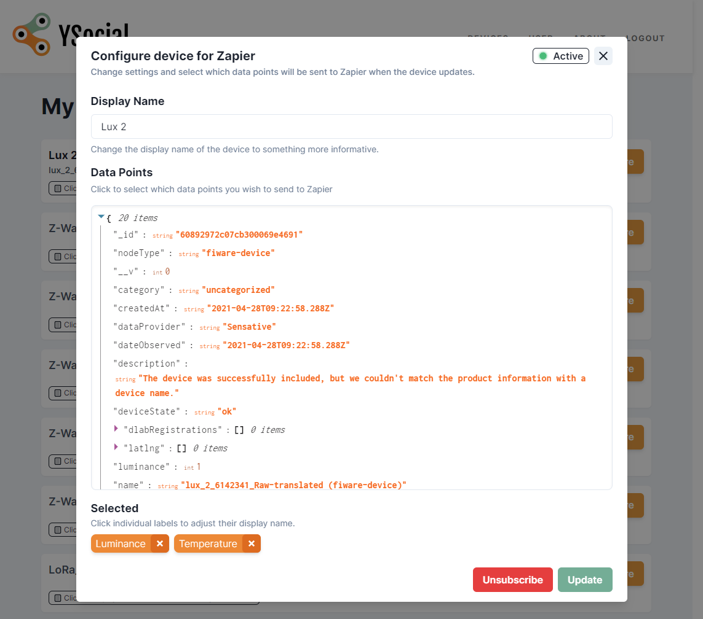

An application that integrates [Sensative AB](https://sensative.com/)'s IoT platform [Yggio](https://sensative.com/yggio/) with the automation platform [Zapier](https://zapier.com/). This allows Yggio users to pass on IoT sensor data to Zapier, where the user can set up rules for what should happen when new data comes in. One main use case was to simply enable a user to automatically tweet new sensor data, but since it's Zapier the possibilities are almost limitless.

It was made as the final group project for my university degree - I was the project leader and architected most of the front- and backend, as well as chose appropriate technologies that everyone in the group felt comfortable working with.

Basically we first use Yggios API to request a list of a users IoT devices as well as their latest reported data, whereupon the user can customize which data fields are relevant and potentially rename them before creating a subscription to that device. This creates a webhook on the Yggio side that automatically sends us updates, these are then handled per the users customization and made available to Zapier. On the Zapier side the user can choose from their subscribed devices to create Zaps, with previews of the device data, etc.

The application was built with React (NextJS), utilizing SWR for data-fetching and Chakra UI for styling. The backend is a REST API made with Express and MongoDB.
